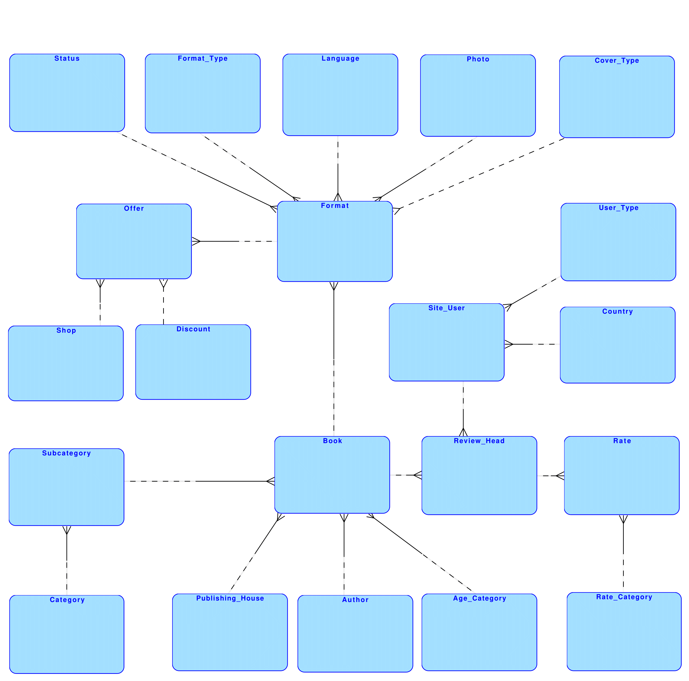
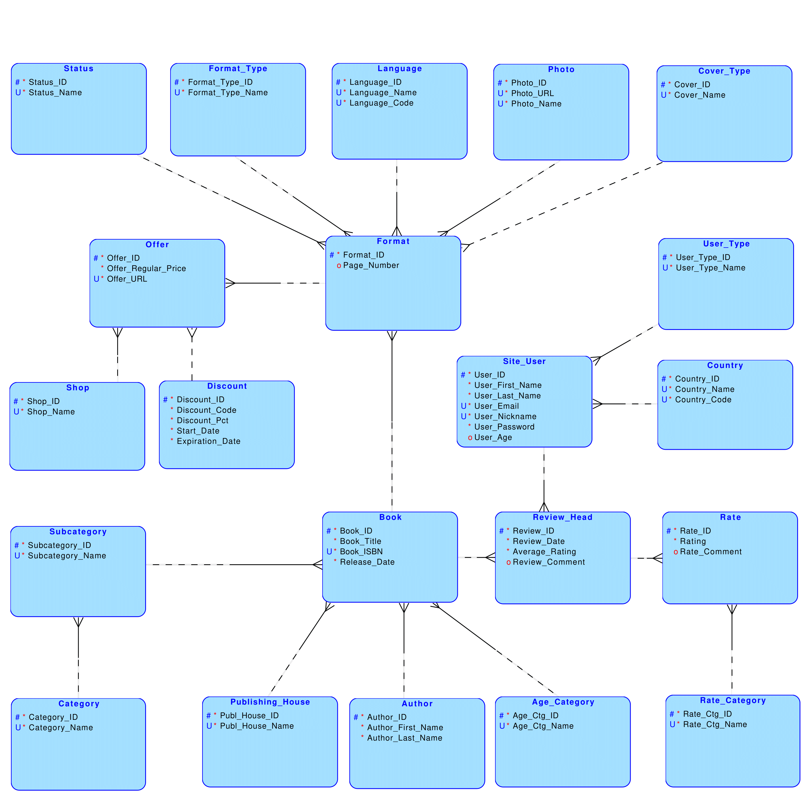
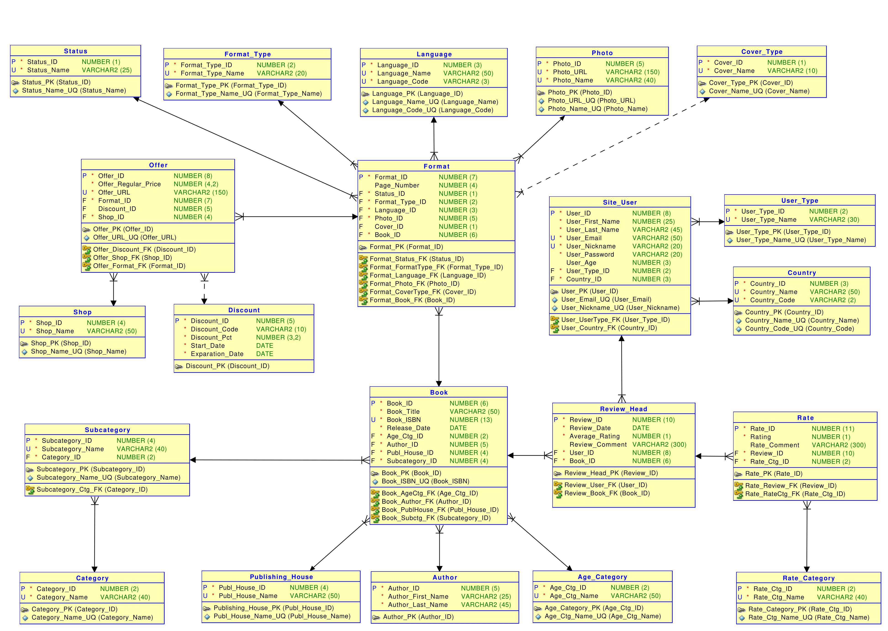

# Porównywarka Książek

## Spis treści
- [O projekcie](#o-projekcie)
- [Opis obszaru rzeczywistości](#opis-obszaru-rzeczywistości)
- [Cel budowy systemu](#cel-budowy-systemu)
- [Opis procesów, obiektów](#opis-procesów,-obiektów)
- [Model konceptualny](#model-konceptualny)
- [Model logiczny](#model-logiczny)
- [Model relacyjny](#model-relacyjny)

## O projekcie
Porównywarka książek jest projektem zaliczeniowym z przedmiotu "Wprowadzenie do Systemów Baz Danych". Projekt miał na celu zaprojektowanie bazy danych, która mogłaby zostać wykorzystana przy implementacji aplikacji opisanej w następnym rozdziale.

## Opis obszaru rzeczywistości
Modelowaną rzeczywistość tworzy strona internetowa, która oferuje użytkownikom możliwość
porównywania ofert książek w sklepach internetowych. Strona internetowa prowadzi działalność w Europie.
Strona oferuje zarejestrowanym użytkownikom możliwość oceniania książek, dzięki czemu osoby
odwiedzające witrynę internetową mogą poznać różne opinie na temat danej książki.
W celu ułatwienia użytkownikom dotarcia do poszczególnych książek, zostały one sklasyfikowane
do różnych kategorii i podkategorii. Każda podkategoria jest przypisana tylko do jednej kategorii, a każda
książka należy tylko do jednej podkategorii. Aby ułatwić czytelnikom wyszukiwanie książek adekwatnych
dla konkretnej grupy wiekowej, zostały one podzielone według kategorii wiekowych.
Ze względu na różnorodność opcji jakie poszukiwać może użytkownik, książki podzielone zostały na
formaty tworzone na podstawie różnych cech np. ze względu na: typ nośnika oraz języki, w których są
napisane czy rodzaj okładki. Skutkiem takiego rozwiązania jest to, że pojedyncza książka postrzegana jako
utwór literacki może posiadać wiele różnych formatów.
Strona pozwala użytkownikom sprawdzić czy dla danej oferty istnieje kod rabatowy pozwalający na
zakup książki po niższej cenie. Przy kodzie rabatowym może widnieć informacja odnośnie czasu ważności
danego kodu rabatowego.
Każdy zarejestrowany użytkownik strony posiada typ użytkownika.
Witryna rozwiązuje problem dotyczący porównywania ofert książek z wielu sklepów, dzięki temu
rozwiązaniu użytkownik nie musi szukać ofert na różnych stronach, tylko ma wszystko w jednym miejscu,
co zaoszczędza jego czas i jest dla niego bardziej przejrzyste.

## Cel budowy systemu
Celem budowy systemu informatycznego, wykorzystującego projektowaną bazę danych jest
stworzenie miejsca, w którym miłośnicy książek z całej Europy mogą zapoznać się oraz porównywać oferty
sklepów internetowych takowe oferujące. Mogą oni również przesyłać swoje opinie na temat danych
książek w formie recenzji, które są widoczne dla innych użytkowników (także tych niezarejestrowanych).
Dzięki takiemu rozwiązaniu przed zakupem danego tytułu użytkownicy mają możliwość zapoznania się z
opinią publiczną na jej temat.
Książki, jak i formaty danych książek podzielone zostały według różnych kryteriów pozwalających
na jak najłatwiejsze wyszukiwanie konkretnego typu książki lub formatu w jakim jest on dostępny w
sprzedaży (np. ktoś może czytać tylko książki dostępne na czytnik e-booków lub tylko kryminały).

## Opis procesów, obiektów
Strona służy do porównywania ofert książek w sklepach internetowych oraz (dla posiadaczy konta)
wystawiania im recenzji. Użytkownicy mogą zarejestrować konto, które jest tworzone na podstawie danych
podanych przez użytkownika, tj. emaila, nazwy użytkownika, hasła, kraju. W celu weryfikacji/identyfikacji
użytkownik podaje imię i nazwisko, opcjonalnie wiek. Wraz z utworzeniem nowego konta użytkownik
automatycznie otrzymuje rangę “nowy użytkownik”.
Każdy zarejestrowany użytkownik może ocenić książkę w skali od 1 do 5. Jest to jego ocena ogólna
danej książki, która jest później wliczana do średniej i wyświetlana na stronie przy danym tytule. Istnieje
również możliwość szczegółowej oceny książki. Dzieli się ona na ocenę według poszczególnych kryteriów
(np. fabuła, kreacja świata, bohaterowie itp.). W takim wypadku wystawiana recenzja zawiera pod oceną
ogólną i komentarzem kolejno oceny szczegółowe i krótkie komentarze do nich.
Użytkownicy są podzieleni ze względu na kraj, a także ze względu na typ użytkownika. Typ
użytkownika jest przydatny przy ocenach danych książek, ponieważ użytkownik, który przeczytał ponad
1000 książek ma lepszy punkt odniesienia przy ocenie danej książki niż użytkownik, który przeczytał 3
książki. Dlatego recenzja danej książki napisana przez użytkownika o typie np. zaufanego recenzenta będzie
bardziej przydatna dla innych użytkowników. Na stronie głównej na podstawie wystawionych recenzji i
kraju, z którego pochodzi użytkownik, wyświetlają się dane statystyczne odnośnie popularności książek.
Typ użytkownika zostaje nadana przez administrację po spełnieniu odpowiednich warunków.
Książki są podzielone ze względu na kategorie (np. popularnonaukowa, edukacyjna, podręcznik,
dramat) i podkategorie (np. dark fantasy, romans historyczny, dramat jezuicki). Oprócz tego posiadają
informacje odnośnie autora, ISBN, daty wydania, kategorii wiekowej (np. dla dzieci, dla dorosłych) czy
wydawnictwa. Dzięki takiemu rozwiązaniu użytkownik bez problemu może odnaleźć interesującą go
książkę, po chociażby autorze.
Książki posiadają również informacje - typ formatu (tj. fizyczna, epub, mobi i pdf), język, typ
okładki oraz zdjęcie okładki.
Każdy użytkownik (zarówno zarejestrowany jak i niezarejestrowany) może przeszukiwać stronę
internetową poszukując danej książki oraz dotyczących jej ofert. Użytkownik wybiera interesującą go
książkę, po czym na stronie wyświetlają się możliwe do zakupu formaty, gdy użytkownik wybierze
konkretną pozycję jego oczom ukaże się lista pokazująca, w których sklepach i za jaką cenę może nabyć
poszukiwany format książki oraz czy oferta posiada kod rabatowy. Użytkownik może wybrać jedną z
wyświetlonych ofert, a to przekieruje go do oferty znajdującej się na stronie wybranego sklepu, gdzie może
dokonać zakupu.

## Model konceptualny

## Model logiczny

## Model relacyjny
